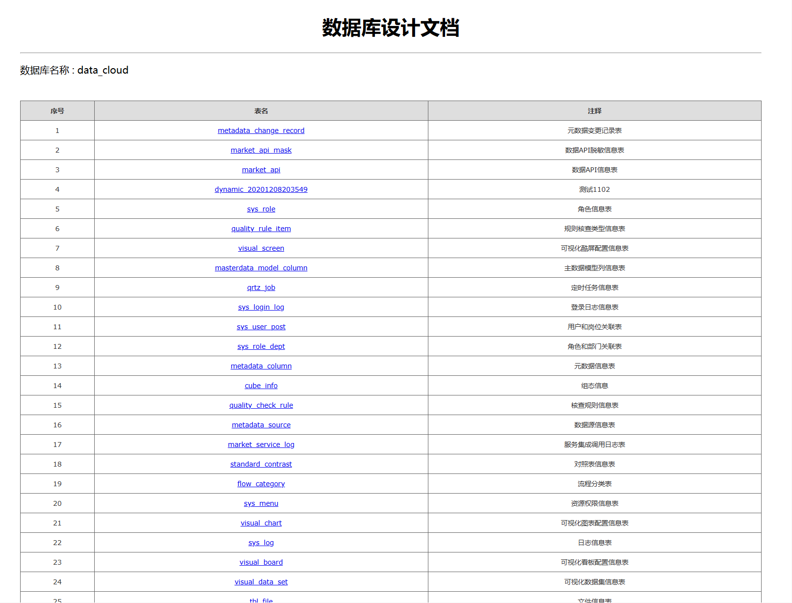
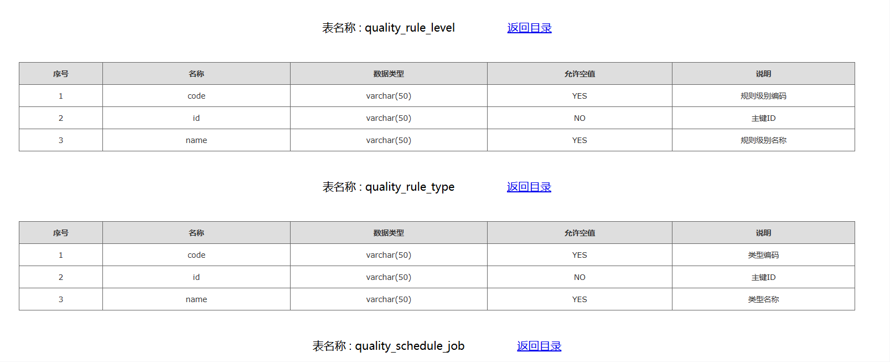

# 数据库文档生成器

<a name="a4d3b02a"></a>
# 概述
这几天在写一些项目交付文档，其中就有数据库的相关文档，同事推荐了一款不错的工具 DBImport[链接](http://www.cyqdata.com/download/article-detail-42517) 但貌似只能在Windows 环境下使用,Linux 环境下出现了一下问题 (我用的是 Deppin发行版),然后变仿照这 DBImport 的思路实现了一个Java版本的。<br /><br /><br /><br />
<a name="a653042e"></a>
# 打包
```shell
mvn clean install
```
# 使用方式

- 填写数据库相关信息，点击测试连接即可显示相关表信息,
- 点击生成文档即可将生成的文档进行下载
# 效果



